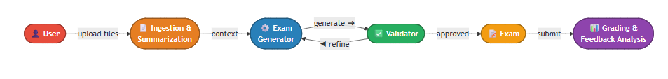
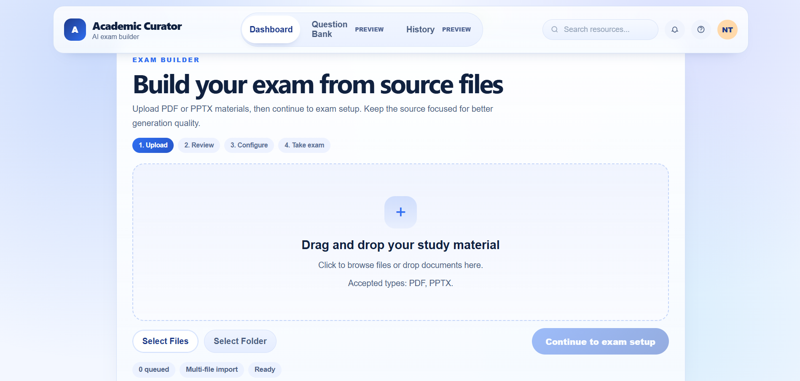
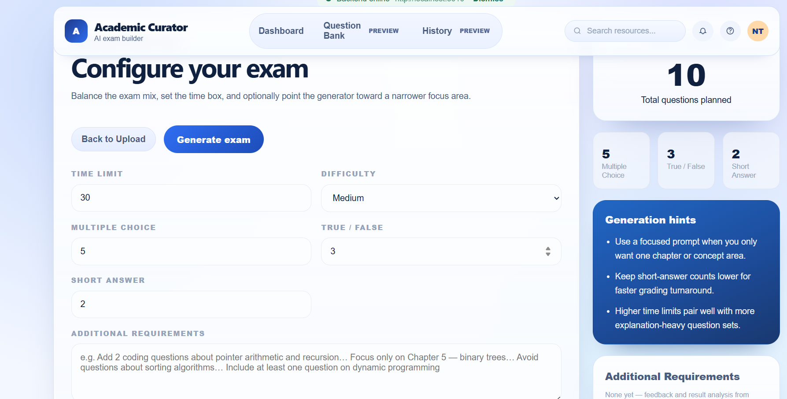
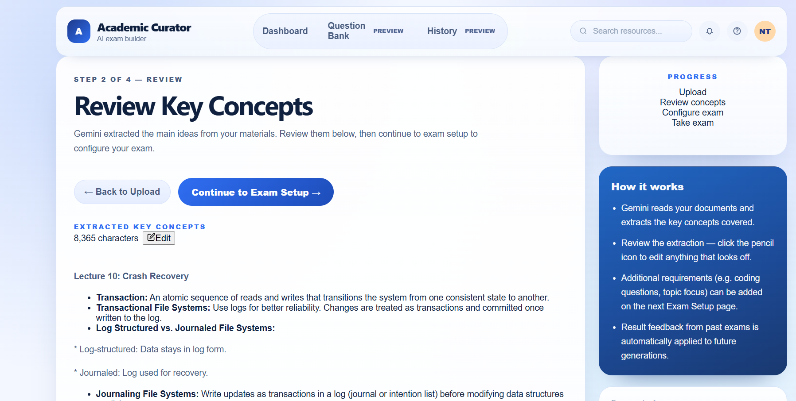
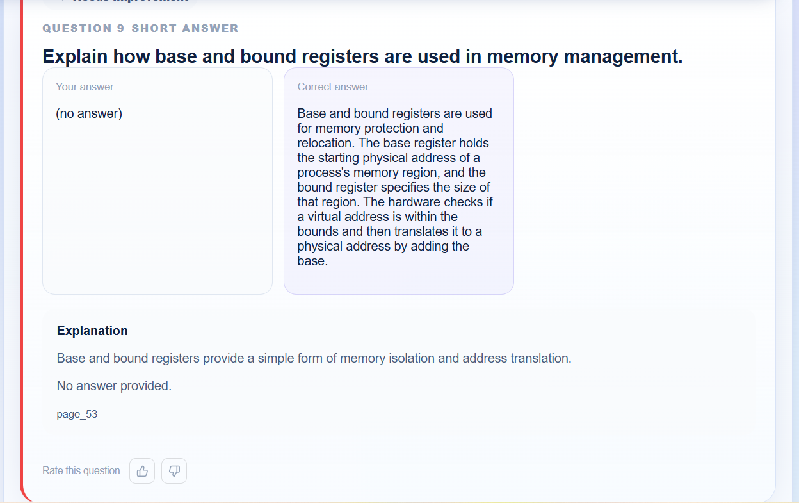

# AI Exam Generator

> Transform lecture slides and PDFs into a ready-to-use examination in minutes, powered by Google Gemini.

A full-stack web application that generates high-quality exam questions strictly grounded in uploaded content. A two-stage BM25 pipeline handles long documents efficiently without GPU embeddings, while a pair of LLM agents handle content summarisation and post-exam result analysis.

## Architecture



The pipeline runs: **File ingestion → Content summarisation → BM25 retrieval → Question generation → Validation (with retry) → Exam delivery → Hybrid grading → Result analysis → Feedback loop**.

For documents exceeding 15 pages, BM25 retrieval activates automatically. Stage 1 uses regex to detect structural problem/exercise blocks; Stage 2 ranks remaining pages by topic relevance, keeping a maximum of 20 pages. Short documents use full context directly.

Short-answer grading uses a two-stage hybrid approach: cosine similarity via `gemini-embedding-001` auto-accepts answers above 0.85 and auto-rejects below 0.50 — only the inconclusive middle band triggers an LLM call, keeping API costs low.

## Screenshots

<table>
  <tr>
    <td align="center"><b>Upload</b></td>
    <td align="center"><b>Configure</b></td>
  </tr>
  <tr>
    <td></td>
    <td></td>
  </tr>
  <tr>
    <td align="center"><b>Take exam</b></td>
    <td align="center"><b>Review results</b></td>
  </tr>
  <tr>
    <td></td>
    <td></td>
  </tr>
</table>

## Features

- **File Upload** — Accepts PDF and PPTX files (single or multiple); extracts text at page/slide level
- **Content Review** — Content Summarizer agent extracts key ideas before exam configuration; user can edit context
- **Two-Stage BM25 Retrieval** — For documents > 15 pages: Stage 1 targets structural homework/problem blocks via regex; Stage 2 uses BM25 (CPU-only, no GPU) to rank pages by topic relevance. Short documents use full context.
- **Question Generation** — Produces MCQ, True/False, Short Answer, and Coding questions via a strict prompt with per-type guidelines and anti-hallucination constraints; language always matches source material
- **Validation & Retry** — Every question is validated for structure, source grounding, and duplicates; retries with lower temperature on failure (up to 2×)
- **Hybrid Grading** — MCQ/True-False: exact match; Short Answer: cosine similarity fast filter → LLM fallback for inconclusive cases
- **Result Analysis Agent** — After grading, a Result Analyzer agent produces targeted improvement recommendations stored for the next exam
- **Additional Requirements** — Stored recommendations are shown on the config page and injected into the next generation prompt
- **Re-generate** — One-click re-generate from the same uploaded materials after reviewing results
- **Export JSON** — Download the full exam (questions, answers, grading details) as a JSON file
- **Interactive Exam UI** — Countdown timer, question navigation, coding question support

## Tech Stack

| Layer | Technology |
|-------|------------|
| Backend | Python, FastAPI |
| LLM | Google Gemini (`gemini-2.0-flash`) |
| Embeddings | Gemini `gemini-embedding-001` (grading only) |
| Retrieval | BM25 via `rank-bm25` (CPU-only, no vector DB) |
| File Parsing | pdfplumber (PDF), python-pptx (PPTX) |
| Frontend | React, React Router, Axios |

## Project Structure

```
backend/
  app.py                  # FastAPI app entry point
  .env                    # GEMINI_API_KEY (not committed)
  requirements.txt
  routes/
    upload.py             # POST /upload, context management, ideas
    generate.py           # POST /generate, grading, analysis, requirements
  services/
    parser.py             # PDF + PPTX text extraction
    bm25_retriever.py     # Two-stage BM25 retrieval for long documents
    embedder.py           # Gemini embeddings (used by grader only)
    generator.py          # Question generation via Gemini
    validator.py          # Question validation (grounding, duplicates)
    grader.py             # Hybrid grading pipeline
  agents/
    content_summarizer.py # Extracts key concepts from uploaded material
    result_analyzer.py    # Analyzes graded results, produces recommendations
  models/
    schema.py             # Pydantic request/response models

frontend/
  src/
    App.js                # Router
    pages/
      UploadPage.jsx          # File upload
      UploadDashboardPage.jsx  # Upload history / dashboard
      ReviewIdeasPage.jsx      # Review & edit extracted content
      ConfigStudioPage.jsx     # Exam configuration + requirements sidebar
      ExamStudioPage.jsx       # Exam taking, grading, results, export
    components/
      Timer.jsx           # Countdown timer
      Question.jsx        # Question renderer (MCQ, T/F, Short Answer, Coding)
```

## Prerequisites

- Python 3.10+
- Node.js 16+
- A Google Gemini API key — get one at https://aistudio.google.com/apikey

## Setup

### 1. Clone the repository

```bash
git clone https://github.com/DanielK345/Exam-generator.git
cd Exam-generator
```

### 2. Backend

```bash
cd backend
pip install -r requirements.txt
```

Create a `.env` file (or edit the existing one) with your API key:

```
GEMINI_API_KEY=your-api-key-here
```

Start the server:

```bash
python -m uvicorn app:app --reload --port 8000
```

The API will be available at `http://localhost:8000`. You can verify with:

```bash
curl http://localhost:8000/health
# {"status":"ok"}
```

### 3. Frontend

```bash
cd frontend
npm install
npm start
```

The app will open at `http://localhost:3000`.

## Usage

1. **Upload** — Upload one or more PDF / PPTX files
2. **Review** — The Content Summarizer agent extracts key ideas; edit the context if needed
3. **Configure** — Set question types, counts, difficulty, time limit, and an optional focus area
4. **Generate** — BM25 retrieval selects the most relevant pages; Gemini generates and validates questions
5. **Take the Exam** — Answer questions before the timer runs out
6. **Submit** — Get your score, correct answers, explanations, and grading feedback
7. **Analyze** — The Result Analyzer agent stores improvement recommendations for the next exam
8. **Re-generate or Export** — Re-run with the same materials, or download the exam as JSON

## API Endpoints

| Method | Endpoint | Description |
|--------|----------|-------------|
| `GET` | `/health` | Health check |
| `POST` | `/upload` | Upload PDF/PPTX files, returns `document_id` |
| `GET` | `/upload/{document_id}` | Get parsed document context |
| `PUT` | `/upload/{document_id}/context` | Update document context (post-review edit) |
| `GET` | `/upload/{document_id}/ideas` | Run Content Summarizer agent |
| `POST` | `/generate` | Generate exam from document + config |
| `GET` | `/exam/{exam_id}` | Retrieve a generated exam |
| `POST` | `/grade` | Grade an exam submission |
| `POST` | `/feedback` | Submit manual feedback for next exam |
| `POST` | `/exam/{exam_id}/analyze` | Run Result Analyzer agent, store recommendations |
| `GET` | `/requirements/{document_id}` | Get stored requirements for a document |
| `DELETE` | `/requirements/{document_id}` | Clear stored requirements |

## Short Answer Grading

Short answers use a hybrid two-stage pipeline to balance accuracy and cost:

1. **Stage 1 — Semantic Similarity (fast filter):**
   Embeds both student and reference answers using `gemini-embedding-001`, computes cosine similarity.
   - `> 0.85` — marked correct (no LLM call)
   - `< 0.50` — marked incorrect (no LLM call)
   - `0.50–0.85` — inconclusive, sent to Stage 2

2. **Stage 2 — LLM Grading (fallback):**
   Calls Gemini with a strict grading prompt. Only used when similarity is inconclusive.

## License

MIT
