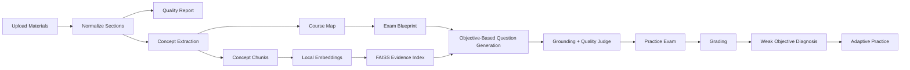

# Architecture

## High-Level Pipeline

## Backend Components

- Upload route accepts mixed academic files and stores a study set under one `document_id`.
- Parser normalizes every file into sections with source labels, document type, extraction method, and quality metadata.
- Concept extractor creates a structured concept knowledge base from normalized sections.
- Course map builder groups useful material into units, concepts, learning objectives, priorities, and ignored material.
- Blueprint builder converts the course map into a question plan before generation.
- Embedder uses Ollama `nomic-embed-text` by default and stores concept chunks in FAISS.
- Generator writes questions from learning objectives and uses concept chunks only as supporting evidence.
- Validator rejects malformed, duplicate, or unsupported questions.
- Quality judge rejects administrative, generic, copied, or too-easy questions.
- Grader scores answers and aggregates weak concepts, units, and learning objectives.

## AI Provider Layer

The provider layer centralizes model access:

- Gemini: high-quality generation, JSON generation, vision-assisted extraction.
- Ollama: local embeddings and optional local text generation.
- FAISS: local vector search over concept chunks.

## Data Flow

Uploaded files are not merged blindly. They become normalized sections, then concepts, then a course map. The course map filters logistics and turns useful content into learning objectives. The blueprint chooses which objectives to test. Question generation works from the blueprint and uses retrieved evidence for grounding.

## Design Tradeoffs

- In-memory stores keep the demo simple but are not production persistence.
- Course-map RAG is more structured than simple chunk RAG and easier to explain in an NLP project.
- Full GraphRAG is future work; the current system stores lightweight prerequisites, misconceptions, and objective-level links.
